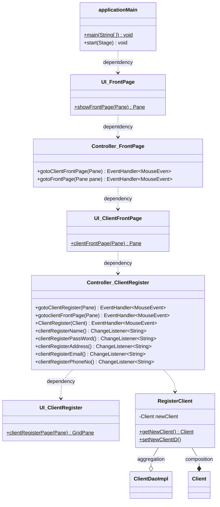
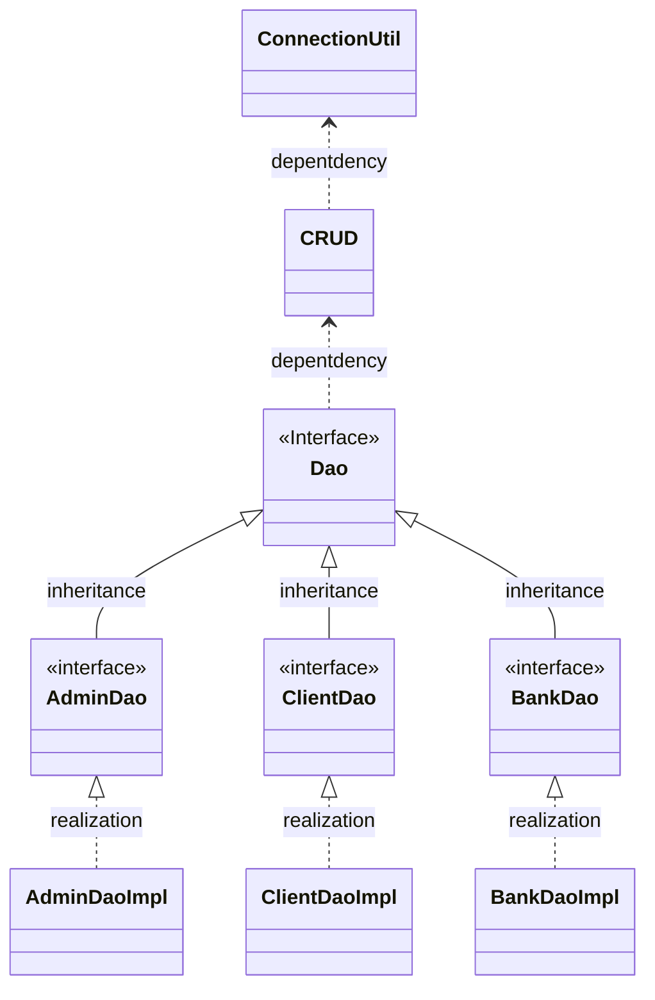
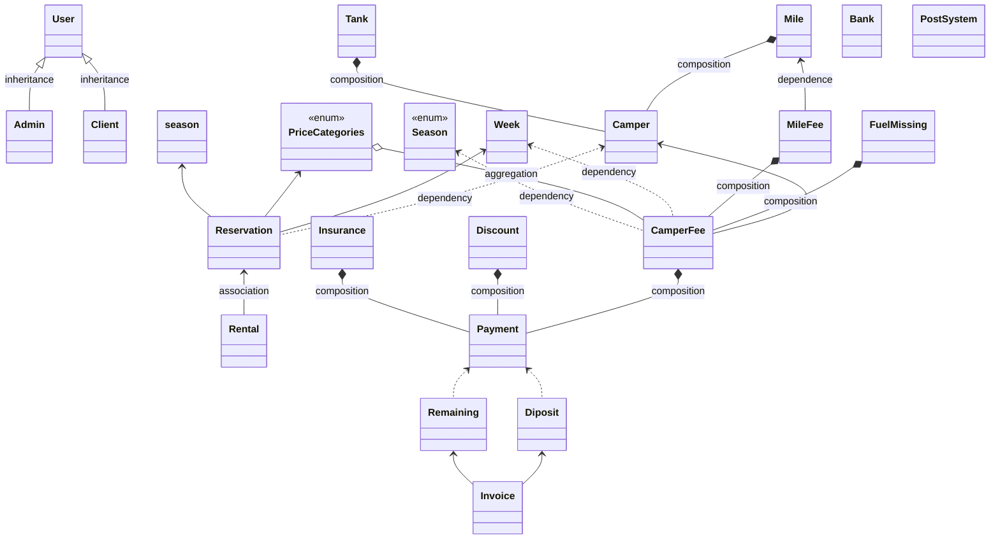
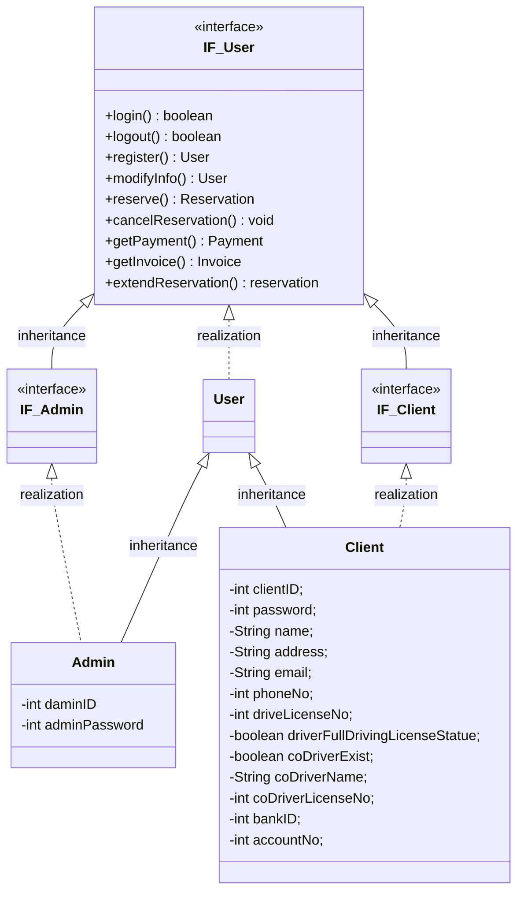
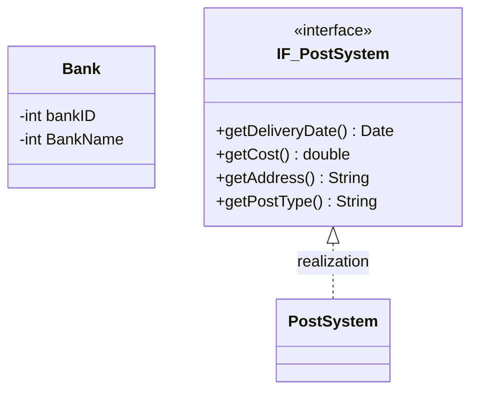
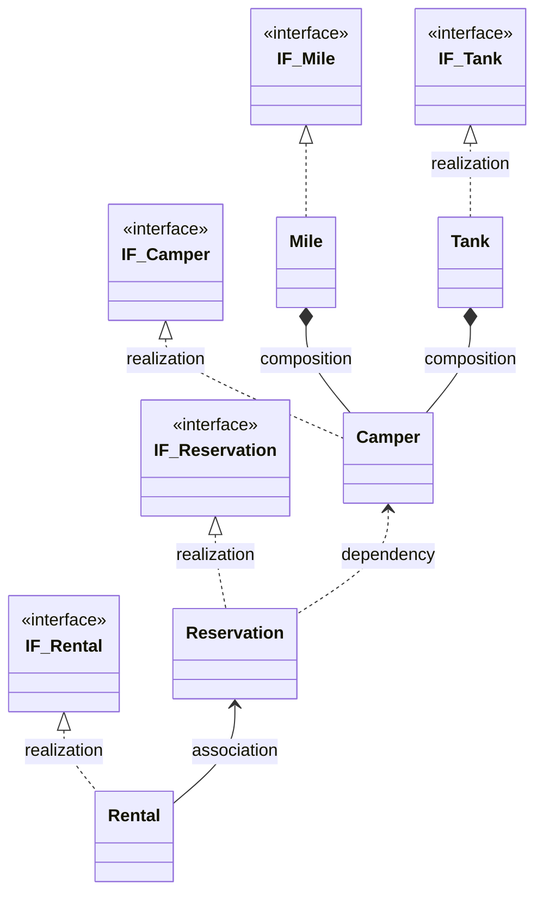
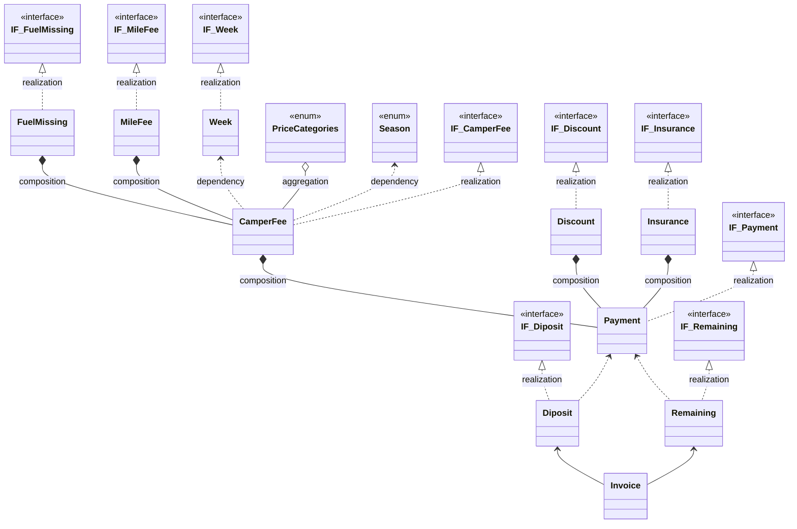

# UI 

This is the part of UI class diagram , it show the main logic about the design of UI class and the connection with the controller class. 

Following the relationship we can also identify about how the method invoke the next level page to reach different purpose.

At the end of the relation chain the UI controller will require the database JDBC read and write the data. 

### Database.User

The database class diagram show about the user package contain. ( which also not the all class, just a part for example )

The connectionUtil include connect database and close database method. 

CRUD containing the create update delete and select method. 

Dao implement class use DAO patten to separate the query and the perparestatement to make the data safety.

# Domain

The domain part is finishing on the UML design 

This class diagram show the part of relationship between different package and class. 

And the each of package class diagram is following. 

### Domain.User

### Domain.RelativeOutSide

### Domain.Product

### Domin.Payment

