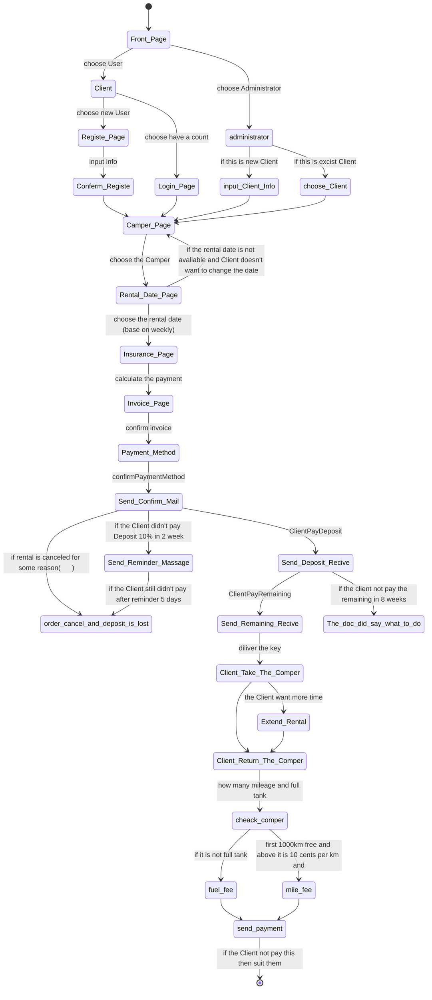

# State Diagram




# Dao

The basic idea about ado patten is separate the database access and the control method for guarantee the data security. 

So following the concept, we make four part of syntax to make sure about it. 

1. Database access part : 

   1. Connection class : to make the connection between JVM and Database( SQL Server ) used by JDBC.
   2. CRUD method to access data. 

2. Dao Interface : 

   To make the comment interface to implement the comment database object, to ensure the database control method. 

   Separate the database access and data operation.

3. Object Dao interface : 

   Specific Object Dao interface extend the comment Dao interface separate the different database/table operation. 

4. Object Dao implement : implement the day interface . Override the specific method. Access the specific data. 

## 1. Database access part

### Connection Class

```java
public class ConnectionUtil {
    public static Connection getConnection() throws Exception {
        InputStream is = ClassLoader.getSystemClassLoader().getResourceAsStream("jdbc.properties");
        Properties pros = new Properties();
        pros.load(is);

        String user = pros.getProperty("user");
        String password = pros.getProperty("password");
        String url = pros.getProperty("url");
        String driverClass = pros.getProperty("driverClass");

        Class.forName(driverClass);

        Connection connection = DriverManager.getConnection(url, user, password);
        System.out.println("The connection is successful : \n" + connection);
        return connection;

    }

    public static void closeConnection(Connection connection) {
        try {
            if (connection != null) {
                connection.close();
                System.out.println("the connection has been closed ! ");
            }
        } catch (SQLException throwables) {
            throwables.printStackTrace();
        }
    }

    public static void closeConAndPS(Connection connection, Statement preparedStatement) {
        try {
            if (preparedStatement != null) {
                preparedStatement.close();
            }
        } catch (SQLException throwables) {
            throwables.printStackTrace();
        }
        try {
            if (connection != null) {
                connection.close();
            }
        } catch (SQLException throwables) {
            throwables.printStackTrace();
        }
    }

    public static void closeConPSAndRS(Connection connection, Statement preparedStatement, ResultSet resultSet) {
        try {
            if (preparedStatement != null) {
                preparedStatement.close();
            }
        } catch (SQLException throwables) {
            throwables.printStackTrace();
        }
        try {
            if (connection != null) {
                connection.close();
            }
        } catch (SQLException throwables) {
            throwables.printStackTrace();
        }
        try {
            if (resultSet != null) {
                resultSet.close();
            }
        } catch (SQLException throwables) {
            throwables.printStackTrace();
        }
    }
```

### Test method

```java
@Test
    public void testGetconnection() throws Exception {
        Connection connection = ConnectionUtil.getConnection();
        ConnectionUtil.closeConnection(connection);

    }


```


### CRUD Class

```java
public class CRUD {

    public static void update(String sql, Object... args) {

        Connection connection = null;
        PreparedStatement preparedStatement = null;

        try {
            connection = ConnectionUtil.getConnection();
            preparedStatement = connection.prepareStatement(sql);
            for (int i = 0; i < args.length; i++) {
                preparedStatement.setObject(i + 1, args[i]);
            }
            preparedStatement.executeUpdate();
        } catch (Exception e) {
            e.printStackTrace();
        } finally {
            ConnectionUtil.closeConAndPS(connection, preparedStatement);
        }
    }

    public static void getInstance(String sql, Object args) {
        Connection connection = null;
        PreparedStatement preparedStatement = null;
        ResultSet resultSet = null;
        try {
            connection = ConnectionUtil.getConnection();
            preparedStatement = connection.prepareStatement(sql);
            preparedStatement.setObject(1, args);

            resultSet = preparedStatement.executeQuery();

            ResultSetMetaData metaData = resultSet.getMetaData();
            int columnCount = metaData.getColumnCount();

            for (int i = 0; i < columnCount; i++) {
                System.out.print(metaData.getColumnName(i + 1) + "\t");
            }
            System.out.println();

            if (resultSet.next()) {
                for (int i = 0; i < columnCount; i++) {
                    System.out.print(resultSet.getObject(i + 1) + "    |    ");
                }
                System.out.println();
            }


        } catch (Exception e) {
            e.printStackTrace();
        } finally {
            ConnectionUtil.closeConPSAndRS(connection, preparedStatement, resultSet);
        }
    }

    public static void getTable(String sql) {
        Connection connection = null;
        PreparedStatement preparedStatement = null;
        ResultSet resultSet = null;

        try {
            connection = ConnectionUtil.getConnection();
            preparedStatement = connection.prepareStatement(sql, ResultSet.TYPE_SCROLL_INSENSITIVE, ResultSet.CONCUR_READ_ONLY);
            resultSet = preparedStatement.executeQuery();
            ResultSetMetaData metaData = resultSet.getMetaData();

            int columnCount = metaData.getColumnCount();
            for (int i = 0; i < columnCount; i++) {
                System.out.print(metaData.getColumnName(i + 1) + "\t");
            }
            System.out.println();

            while (resultSet.next()) {
                for (int i = 0; i < columnCount; i++) {
                    System.out.print(resultSet.getString(i + 1) + "      |      ");
                }
                System.out.println();
            }

            resultSet.beforeFirst();
        } catch (Exception e) {
            e.printStackTrace();
        } finally {
            ConnectionUtil.closeConPSAndRS(connection, preparedStatement, resultSet);
        }

    }
```

### Test method

```java
@Test
    public void testUpdate() {
        try {
            String sql = "update tbl_Bank set fld_BankName = ? where fld_BankID = ? ";
            update(sql, "DanskBank", 1);
            System.out.println("update finished");
        } catch (Exception e) {
            e.printStackTrace();
        }
    }

    @Test
    public void testDelete() {
        try {
            String sql = " delete from tbl_Bank where fld_BankID = ? ";
            update(sql, 1);
            System.out.println("delete finished");
        } catch (Exception e) {
            e.printStackTrace();
        }
    }

    @Test
    public void testGetInstance() {
        String sql = "select fld_BankID, fld_BankName from tbl_Bank where fld_BankID = ?";
        getInstance(sql, 1);
    }

    @Test
    public void testGetTable() {
        String sql = "select * from tbl_Bank";
        getTable(sql);
    }
```


## 2. The Base Dao Interface

```java
public interface Dao<T> {
    public void add(T t);

    public void update(T t);

    public void delete(int id);

    public void getInstance(int id);

    public void getAll();
}
```


## 3. The Client Dao interface

```java
public interface ClientDao extends Dao<Client> {
}
```


## 4. The Client Dao implement

```java
public class ClientDaoImpl implements ClientDao {

    @Test
    public void testAdd() {
        Client client = new Client();
        client.setClientID(3);
        client.setName("Fei Gu3");
        client.setAddress("Odense3");
        client.setEmail("feix0033@easv365.dk2");
        client.setPhoneNo(12345678);

        add(client);
    }

    @Test
    public void testUpdate() {
        Client client = new Client();
        client.setClientID(001);
        client.setName("Fei Gu update ");
        client.setAddress("Odense update");
        client.setEmail("feix0033@easv365.dk update");
        client.setPhoneNo(87654321);

        update(client);

    }

    @Test
    public void testDelete() {
        delete(1);

    }

    @Test
    public void testGetInstance() {
        getInstance(1);
    }

    @Test
    public void testGetAll() {
        getAll();
    }


    @Override
    public void add(Client client) {

        try {
            String sql = "insert into tbl_Client (fld_ClientID, fld_Name, fld_Address, fld_EmailAddress, fld_PhoneNo) values (?,?,?,?,?)";

            int clientID = client.getClientID();
            String name = client.getName();
            String address = client.getAddress();
            String email = client.getEmail();
            int phoneNo = client.getPhoneNo();

            CRUD.update(sql, clientID, name, address, email, phoneNo);
            System.out.println("Add database table Client successful!");

        } catch (Exception e) {
            e.printStackTrace();
        }
    }

    @Override
    public void update(Client client) {
        try {
            String sql = "update tbl_Client set fld_Name = ? , fld_Address = ?, fld_EmailAddress = ? , fld_PhoneNo = ? where fld_ClientID = ?";

            int clientID = client.getClientID();
            String name = client.getName();
            String address = client.getAddress();
            String email = client.getEmail();
            int phoneNo = client.getPhoneNo();

            CRUD.update(sql, name, address, email, phoneNo, clientID);
            System.out.println("Update database table Client is successful! ");

        } catch (Exception e) {
            e.printStackTrace();
        }
    }

    @Override
    public void delete(int id) {
        try {
            String sql = "delete from tbl_Client where fld_ClientID = ?";
            CRUD.update(sql, id);
            System.out.println("Delete database table Client is successful!");
        } catch (Exception e) {
            e.printStackTrace();
        }
    }

    @Override
    public void getInstance(int id) {
        String sql = "select fld_ClientID, fld_Name, fld_Address, fld_EmailAddress, fld_PhoneNo from tbl_Client where fld_ClientID = ?";
        CRUD.getInstance(sql, id);
    }

    @Override
    public void getAll() {
        String sql = "select * from tbl_Client";
        CRUD.getTable(sql);
    }

}

```


# Singleton

The singleton patten make sure each time when we need the Object and its method. We only make “One” object. 

Right here we use the patten for make sure when we get a new value from the UI input.  We can just change the same one object but not create a new object. 

```java
public class RegisterClient {
    private static Client newClient = new Client();

    private RegisterClient() {
    }


    public static Client getNewClient() {
        return newClient;
    }

    public static void setNewClientID() {
        /* use hashCode() method to set the ClientID : 
         * this is a simple and unique way to identify the customer 
         * but there is a not easy way to find the specific user so
         * I should make a searching method to find the ClientID.
         */
        newClient.setClientID(newClient.hashCode());
    }

}
```

