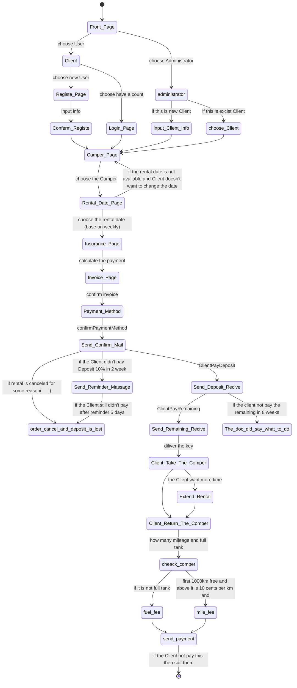

# State Diagram

```mermaid
stateDiagram-V2
[*] --> Front_Page
Front_Page --> Client : choose User
    Client --> Registe_Page : choose new User
    	Registe_Page --> Conferm_Registe : input info
    		Conferm_Registe --> Camper_Page
    		
    Client --> Login_Page : choose have a count
		Login_Page --> Camper_Page

Front_Page --> administrator : choose Administrator
	administrator --> input_Client_Info : if this is new Client
		input_Client_Info --> Camper_Page
    administrator --> choose_Client : if this is excist Client
    	choose_Client --> Camper_Page
    	
Camper_Page --> Rental_Date_Page : choose the Camper
    Rental_Date_Page --> Insurance_Page : choose the rental date (base on weekly)
        Rental_Date_Page --> Camper_Page : if the rental date is not avaliable and Client doesn't want to change the date

Insurance_Page --> Invoice_Page : calculate the payment

Invoice_Page --> Payment_Method : confirm invoice

Payment_Method --> Send_Confirm_Mail : confirmPaymentMethod

Send_Confirm_Mail --> Send_Deposit_Recive : ClientPayDeposit
	Send_Confirm_Mail --> order_cancel_and_deposit_is_lost : if rental is canceled for some reason(      )    
	Send_Confirm_Mail --> Send_Reminder_Massage : if the Client didn't pay Deposit 10% in 2 week
		Send_Reminder_Massage --> order_cancel_and_deposit_is_lost : if the Client still didn't pay after reminder 5 days
		
Send_Deposit_Recive --> Send_Remaining_Recive : ClientPayRemaining
	Send_Deposit_Recive --> The_doc_did_say_what_to_do : if the client not pay the remaining in 8 weeks
	
Send_Remaining_Recive --> Client_Take_The_Comper : diliver the key
Client_Take_The_Comper --> Client_Return_The_Comper
	Client_Take_The_Comper --> Extend_Rental : the Client want more time
    	Extend_Rental --> Client_Return_The_Comper
Client_Return_The_Comper --> cheack_comper : how many mileage and full tank
	cheack_comper --> fuel_fee : if it is not full tank  
	cheack_comper --> mile_fee : first 1000km free and above it is 10 cents per km and 
fuel_fee --> send_payment 
mile_fee --> send_payment
send_payment --> [*] : if the Client not pay this then suit them


```

