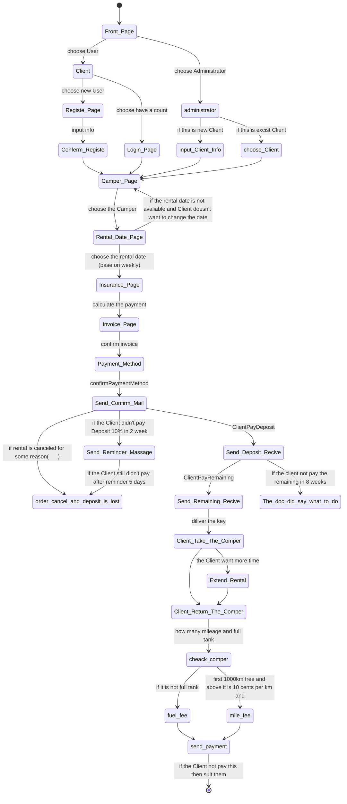

Class: D20
Semester: 2. semester
Time period (work): Week 17 – 18 , 2021 Subjects: System development (UP), Databases and Programming
Important milestones:
This assignment handed out: Friday April 23rd
Report hand-in: Friday May 7thAt 15.00.
Presentation/Oral Feedback: Tuesday/Thursday May 11/13(20 min per group).

# The Case

- the administration of their auto camper rental business

# Requirements for your solution

1. The main purpose of the project is to get some training within these areas:
   - Organizing your work activities according to Unified Process.
   - Object modeling (object design)
   - Database modeling, JDBC, stored procedures.
2. Our main goal should NOT be to make a complete system – by doing it the ”quick-and-dirty” way.
3. The system development method must be UP with documentation in UML.
4. The database used in the project must be SQL Server.
5. We expect these artifacts to be present and explained in the report:
   - Use Cases (only one fully dressed).
   - Domain Model.
   - Data Model (ERD)
   - Data Dictionary. 
   - SSDs : At least one Sequence-diagram.
   - The Architecture (layered) in a diagram.
   - The (final) Design Class Diagram.
6. Also explain how patterns are applied shortly – for example GRASP, Singleton, Dao, Strategy but always discuss a pattern together with a code example from with-in the project!
7. The programming language must be Java – here it is important that you have ”waterproof” consistency between your UML artifacts (documentations behind the code) and the Java code itself.
8. Furthermore: The UI should be simple JavaFX, and at least two methods must be Unit-tested.

# Hand-ins:

- You must use moodle to hand in the report (approx. 10 pages)

- source code (also database queries, stored procedures etc.)

- UP artefacts.

  > See the document: guidelines for report writing.pdf

- Finally, you must prepare and make a short presentation (PowerPoint) of the designed solution – this must be ready for the 11th of May.

# Time scheduel

| Monday(26th) | 27th            | 28th | 29th                          | 30th | 1st         | 2nd  | 3rd  | 4th         | 5th  |
| ------------ | --------------- | ---- | ----------------------------- | ---- | ----------- | ---- | ---- | ----------- | ---- |
| Vision       | Data Dictionary |      | SSDs                          | DCD  | Coding part |      |      | Report part |      |
| Use case     | ERD             |      | Architecture(tommy’s week 09) |      |             |      |      |             |      |
|              |                 |      |                               |      |             |      |      |             |      |

# Unify process

| Inception               | Elaboration       | Construction          | Transition |
| ----------------------- | ----------------- | --------------------- | ---------- |
| Feasibility study       |                   | Program the functions | Test       |
| - Decision Stop or Go   | Refile the vision | Create a user         | Deploy     |
| - Estimations           | Core architecture |                       |            |
| - vision                | Use case          |                       |            |
| - Environment           |                   |                       |            |
| - choose language :java |                   |                       |            |

#### Feasibility study 可行性研究

* Decision Stop or Go
* Estimations 预估 ( how many resourse we have )
* Vision ( a short sentance to say what we are building / a pic for the programming , functional word , becareful do not use the contents which you can never finish it. )
* Environment 
* Programming laugage choice

# State Diagram

