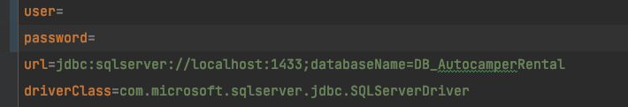
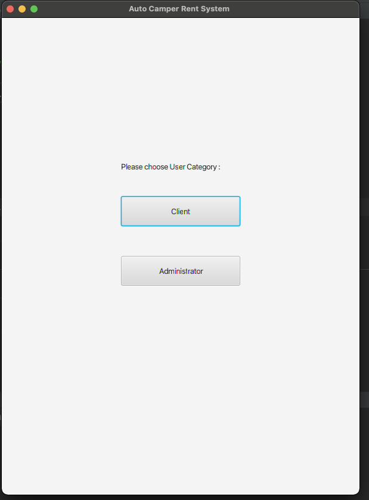

# ReadMe
***The auto-camper Rental business Application*** 

## Introduction

This is a student training project from EASV D20. 

The team is designing and creating an administration and booking system for Wagner Families auto camper rental business. The system is created for rental of a fleet of auto campers, and it should be time-efficient and easily manageable for the Wagner family, modernizing the way they do business.

The repository include following : 

1. Document : all the diagrams, requirement PDF and the final report.
2. LIb : sql script and JDBC package
3. RentalSystem : the application code
4. ReadMe : this markdown file you are looking now :D

[TOD]

## Installation

### Create the sql database

==This application base on SQL Server, so please make sure you have install and running it.==

Following step to insert base database and table into your database: 

1. Download JDBC from Microsoft : https://docs.microsoft.com/en-us/sql/connect/jdbc/download-microsoft-jdbc-driver-for-sql-server?view=sql-server-ver15

2. Import Libraries into your Modules :

   (Example from IntelliJ ) Project Setting -> Libraries -> “+”  -> java -> choose the JDBC file you download from Microsoft.

   

3. Right click your JDBC file: 

   

4. Add to Modules… : add your JDBC into Module.

5. Open sql script  `lib/script.sql` from SSMS and run the script. 

6. Open properties file and change the user and password as your database username and password. 

   

## Run the program

The mean entry for this program is the class application `RentalSystem/src/ApplicationMain.java`

Run it and you can see the javaFx-build front-page :

